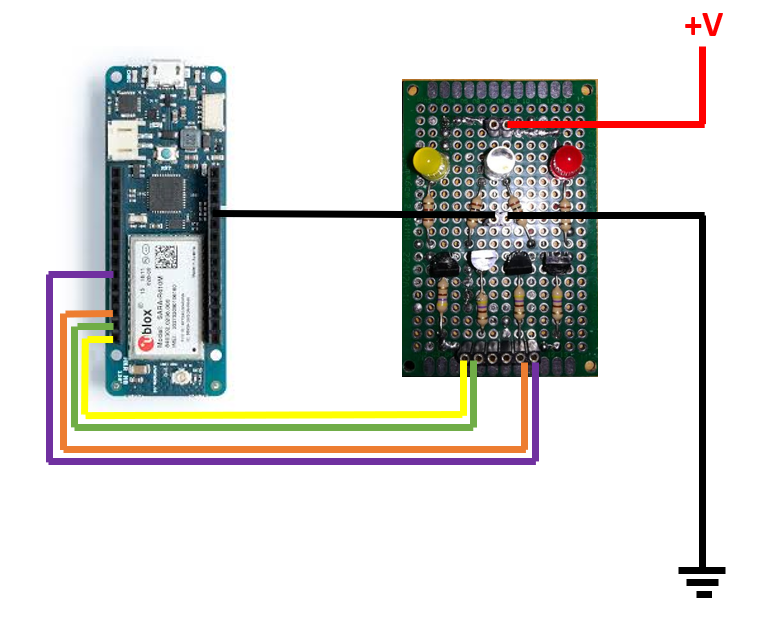
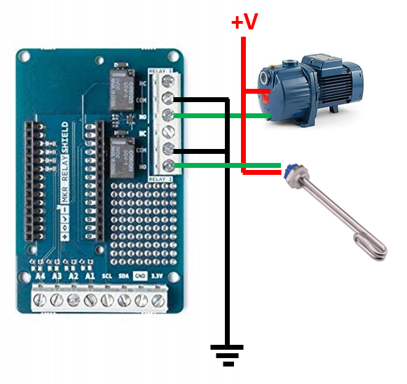
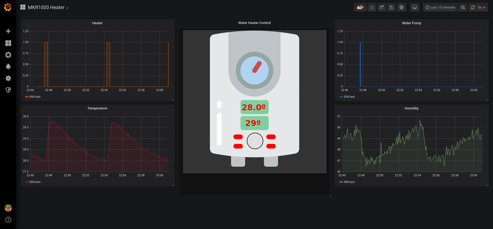
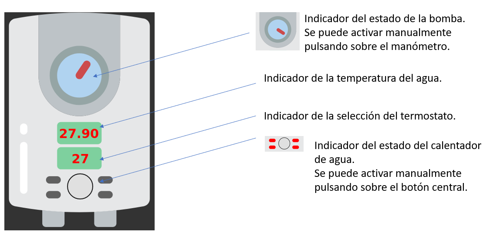

# PLA9

Aquí está el código fuente para la PLA9. En concreto, la parte que corre dentro de la MKR1000. El resto, los flujos de Node-RED esán en https://github.com/gnietoUOC/PLA9-Node

El código recoge las mediciones de temperatura y, en función del valor seleccionado por un termostato, mediante un relé se activa una resistencia que simula un calentador de agua. También controla un segundo relé para simular la puesta en marcha de una bomba de agua.

A continuación se muestra la forma de conectar el panel de control.

En esta otra imagen se muestra como conectar la resistencia y la bomba.

Por último una imagen del aspecto del panel de control en Grafana que integra un dashboard de Node-RED.

En esta imagen se muestra qué información aparece en el panel y como actuar sobre el para activar manualmente los relés.

